# Hi there, I'm Simon

I'm a passionate developer and the founder of **Mandat** and **CygnisAI**. I build civic tech platforms and intelligent generative AI solutions to make the world more open and connected.

---

  <h3><code>simon@github ~ $ ./contributions.sh</code></h3>
  
    
  <h3><code>simon@github ~ $ whoami</code></h3>
  <table>
    <tr>
      <td valign="top">
        
      </td>
      <td valign="top">
        
      </td>
    </tr>
  </table>

---

### About Me

- **I'm currently working on:** Leading the development of [CygnisAI](https://cygnis-ai.vercel.app), focusing on creating a seamless user experience and integrating advanced generative AI models. Also maintaining [Mandat](https://github.com/Simonc44/mandat).
- **I'm currently learning:** Advanced techniques in Large Language Model (LLM) orchestration, multi-modal generation, and scaling AI applications with serverless technologies.  
- **I'm looking to collaborate on:** Open-source AI projects, innovative developer tools, and anything that pushes the boundaries of human-computer interaction.  
- **I'm looking for help with:** Feedback and contributions for Mandat to make it even better!  
- **Ask me about:** AI/ML, Next.js, Firebase, TypeScript, and building SaaS products from the ground up.  
- **How to reach me:** Connect with me on [LinkedIn](https://www.linkedin.com/in/simon-chusseau-91541a378/).

---

### My Tech Stack

  

---

> "The best way to predict the future is to build it."
